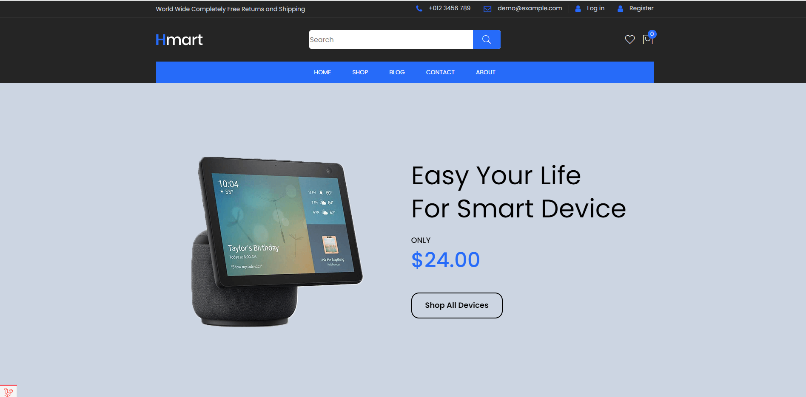
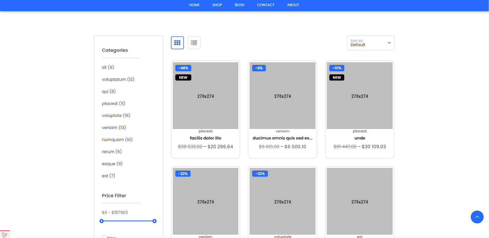
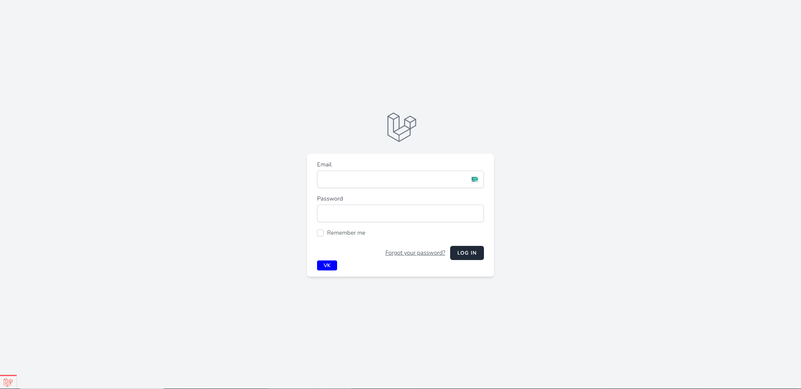
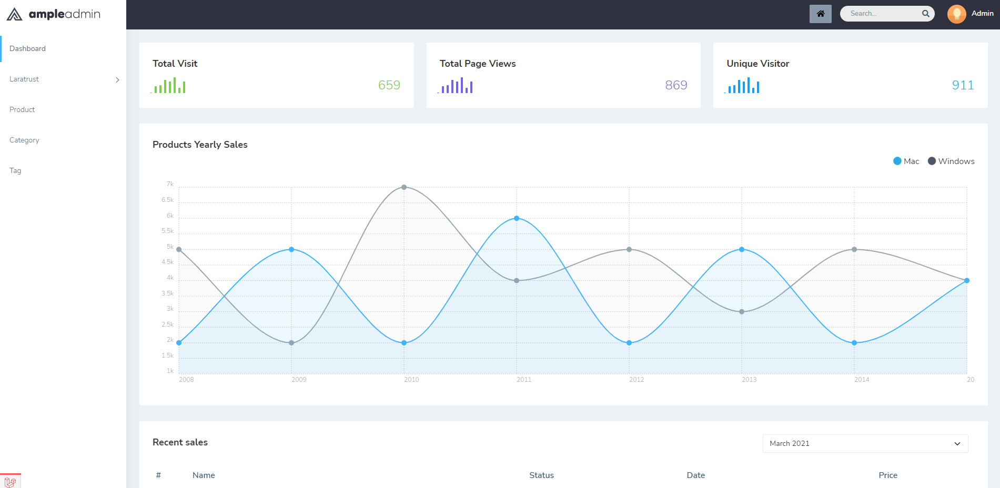
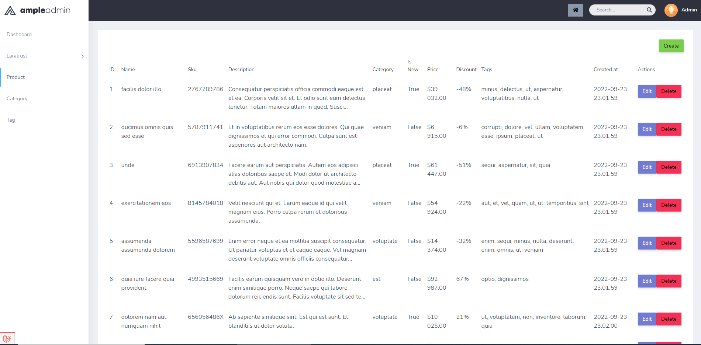

## О проекте

Это тестовый проект магазина для просмотра возможностей Laravel.

[Ссылка на шаблон](https://bootstraptema.ru/stuff/templates_bootstrap/shop/hmart/7-1-0-4989)
[Ссылка на шаблон админки](https://www.wrappixel.com/templates/ample-admin-lite/?ref=17)

<details>
  <summary>Скриншоты</summary>
  
  
  
  
  
  
  
</details>

## VK авторизация

Для авторизации через VK заполнить VK_CLIENT_ID и VK_CLIENT_SECRET в .env

## Ссылки

[phpmyadmin](http://localhost:8080)

## Установка
1. Склонировать проект
   ```
   git clone https://github.com/DarKsandr/shop.git
   ```
2. Установить зависимости приложения, перейдя в каталог приложения и выполнив следующую команду. Эта команда использует небольшой контейнер Docker, содержащий PHP и Composer, для установки зависимостей приложения:

    ```
    docker run --rm \
        -u "$(id -u):$(id -g)" \
        -v $(pwd):/var/www/html \
        -w /var/www/html \
        laravelsail/php81-composer:latest \
        composer install --ignore-platform-reqs
    ```
3. Запустить проект
   ```
   ./vendor/bin/sail up -d
   ```
4. Копировать env файл и сгенерировать APP_KEY
   ```
   cp .env.example .env
   ./vendor/bin/sail artisan key:generate
   ```
5. Фикс env файла (./.env: строка 6: $'\r': команда не найдена)
   ```
   sed -i 's/\r$//' .env
   ```
6. Установка npm и build
   ```
   ./vendor/bin/sail npm install 
   ./vendor/bin/sail npm run build
   ```
7. Миграции и создание первоначальных данных
   ```
   ./vendor/bin/sail artisan migrate
   ./vendor/bin/sail artisan db:seed
   ```